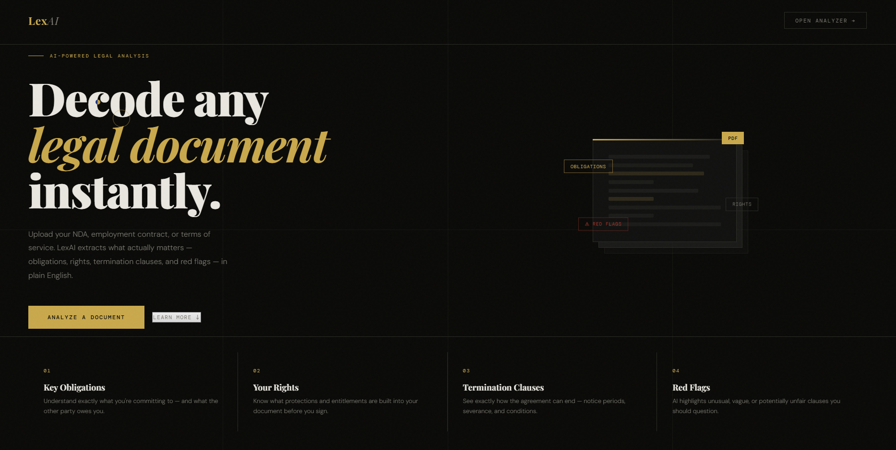
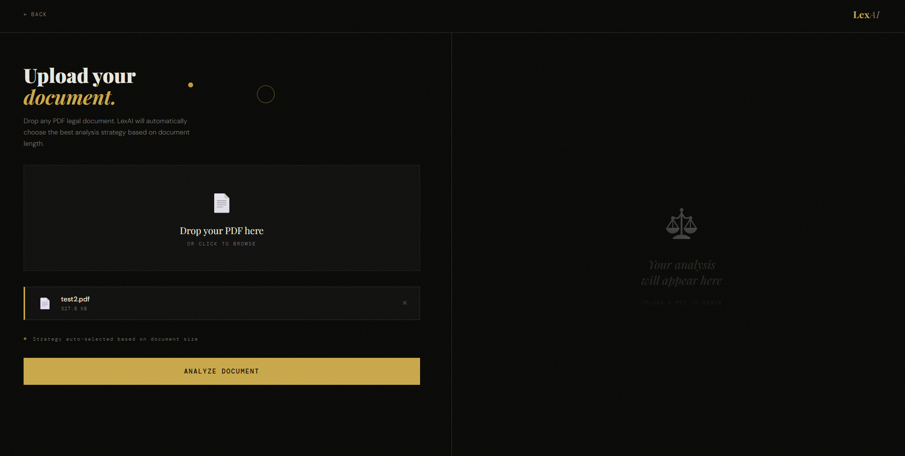
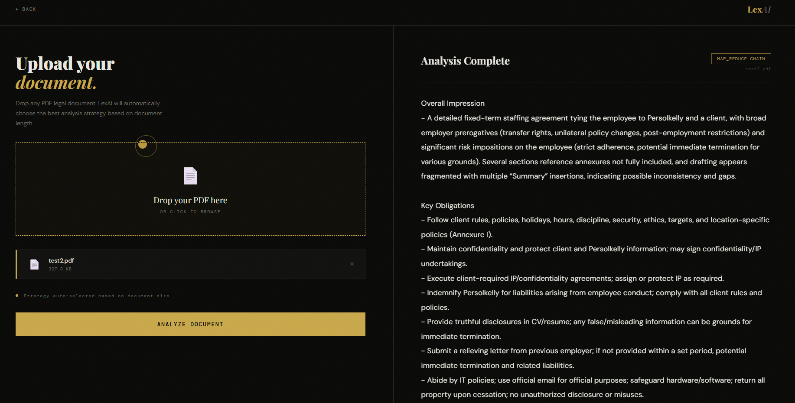

# ⚖️ LexAI — Legal Document Summarizer

> Upload any legal document — NDA, employment contract, or terms of service — and get a plain-English summary highlighting key obligations, rights, termination clauses, and red flags.



---

## 📌 About the Project

Reading legal documents is painful. LexAI solves that.

You upload a PDF, the AI reads it, and you get a clean structured breakdown — in plain English — of everything that actually matters. No legal jargon. No fluff.

This project was built as part of my **LangChain learning journey**, focusing on a critical real-world design decision: **which summarization strategy to use depending on document size**.

---

## 🖥️ Interface

### Upload Your Document


### Get Your Summary


---

## 🧠 What It Extracts

| Section | Description |
|---|---|
| 🔍 Overall Impression | General assessment of the document |
| 📋 Key Obligations | What each party is committing to |
| ⚖️ Rights | Protections and entitlements |
| 🔚 Termination Clauses | How and when the agreement can end |
| 🚩 Red Flags | Unusual, vague, or unfair clauses |
| ✅ Suggestions | How to finalize and reduce risk |
| 📝 Concise Summary | Quick plain-English overview |

---

## ⚙️ How It Works

### Summarization Strategy — Auto Selected

The pipeline automatically decides which strategy to use based on document size.

```
Load PDF → Check total character count
              │
              ├── < 10,000 chars → Stuff Chain
              │
              └── > 10,000 chars → Map-Reduce Chain
```

---

### Strategy 1 — Classical LangChain: `load_summarize_chain`

The first implementation used LangChain's built-in `load_summarize_chain` with both `stuff` and `map_reduce` chain types.

**Stuff Chain** — entire document in one prompt, one API call.
```python
chain = load_summarize_chain(llm, chain_type="stuff", prompt=prompt)
result = chain.invoke({"input_documents": docs})
```

**Map-Reduce Chain** — splits document into chunks, summarizes each, then combines.
```python
chain = load_summarize_chain(
    llm,
    chain_type="map_reduce",
    map_prompt=map_prompt,
    combine_prompt=combine_prompt
)
result = chain.invoke({"input_documents": chunks})
```

**Problem:** `load_summarize_chain` processes chunks **sequentially** — slow for large documents.

---

### Strategy 2 — LCEL Chain (Faster)

The second implementation used **LangChain Expression Language (LCEL)** to run the map step in **parallel** using `.batch()`.

```python
# Map step — runs all chunks simultaneously
map_chain = map_prompt | llm | StrOutputParser()
summaries = map_chain.batch(chunks)

# Combine step
combine = RunnableLambda(lambda s: {"text": "\n\n".join(s)})
reduce_chain = combine_prompt | llm | StrOutputParser()

full_chain = combine | reduce_chain
final_summary = full_chain.invoke(summaries)
```

**Result:** Significantly faster for large documents because all chunks are processed in parallel instead of one by one.

---

### Key Difference

| | Classical (`load_summarize_chain`) | LCEL |
|---|---|---|
| Map step | Sequential | Parallel (`.batch()`) |
| Control | Abstracted | Full control |
| Speed (large docs) | Slower | Faster |
| Code complexity | Simple | More explicit |

---

## 🗂️ Project Structure

```
legal-summarizer/
│
├── main.py              # FastAPI backend
├── pdf_loader.py        # PDF loading + strategy decision
├── doc_split.py         # Document chunking
├── chain.py             # Summarization chains (Classical + LCEL)
├── make_prompt.py       # Prompt templates
│
├── index.html           # Frontend (HTML/CSS/JS)
│
├── assets/
│   ├── landing.png
│   ├── upload.png
│   └── result.png
│
├── requirements.txt
└── .env                 # API keys (not committed)
```

---

## 🚀 Getting Started

### 1. Clone the repo
```bash
git clone https://github.com/yourusername/legal-summarizer
cd legal-summarizer
```

### 2. Install dependencies
```bash
pip install -r requirements.txt
```

### 3. Set up environment variables
Create a `.env` file in the root —
```
OPENAI_API_KEY=your_openai_api_key
```

### 4. Run the API
```bash
uvicorn main:app --reload
```

### 5. Open the frontend
```bash
python -m http.server 5500
```
Then open `http://localhost:5500/index.html`

---

## 📦 Requirements

```
langchain
langchain-openai
langchain-community
pypdf
openai
python-dotenv
tiktoken
fastapi
uvicorn
python-multipart
rich
```

---

## 💡 Key Learnings

- **Stuff vs Map-Reduce** — not just a LangChain decision, but a real architectural tradeoff between speed, cost, and context quality
- **LCEL `.batch()`** — parallel execution of map steps dramatically improves performance on large documents
- **Prompt design matters more than chain type** — the quality of legal extraction lives entirely in your prompt
- **Legacy chains vs LCEL** — `load_summarize_chain` is simpler but LCEL gives you control and speed

---

## 👨‍💻 Built By

**Dhanraj Verma** — CV Engineer transitioning into GenAI  
Documenting the journey publicly → [@senn.developer](https://instagram.com/senn.developer)

---

> *This project is for educational purposes. LexAI is not a substitute for professional legal advice.*